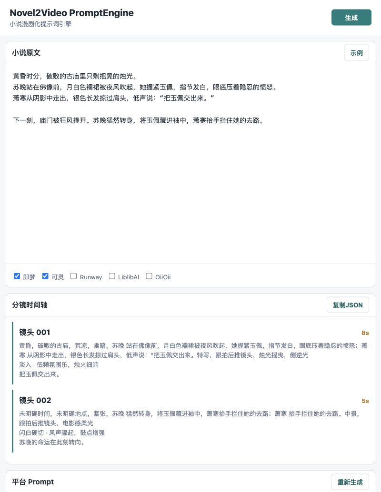
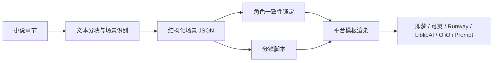

# Novel2Video PromptEngine

小说漫剧化提示词引擎：把小说章节自动拆解为结构化分镜、角色一致性锁定描述，并生成可直接复制到 AI 视频平台的专属 Prompt。



## 它能做什么

- 小说文本解析：提取场景、地点、时间、氛围、角色、动作、情绪、道具、对白和镜头语言。
- 角色一致性管理：为跨场景角色生成固定外貌描述、风格锚点、禁止变化项和参考图提示词。
- 多平台 Prompt 适配：内置即梦、可灵、Runway、LiblibAI、OiiOii 五个平台模板。
- 分镜脚本输出：按镜号排列，包含画面内容、时长、转场、音效/BGM 和字幕建议。
- 双模式解析：默认离线启发式解析；配置 API Key 后可切换 OpenAI-compatible LLM 解析。

## 快速开始

```bash
git clone https://github.com/liwenqihh-dotcom/novel2video-promptengine.git
cd novel2video-promptengine
```

### CLI 生成 Markdown 报告

```bash
python3 scripts/novel2video_cli.py \
  --input assets/sample_novel.txt \
  --platforms jimeng,kling \
  --format markdown \
  --out report.md
```

### CLI 生成 JSON

```bash
python3 scripts/novel2video_cli.py \
  --input assets/sample_novel.txt \
  --platforms jimeng,kling,runway,liblibai,oiioii \
  --format json \
  --out result.json
```

## 启动 Web 界面

安装依赖：

```bash
python3 -m pip install -r scripts/requirements.txt
```

启动服务：

```bash
python3 scripts/api_server.py
```

打开：

```text
http://127.0.0.1:8787
```

Web 界面包含小说输入区、平台选择、分镜时间轴、平台 Prompt Tab、复制 JSON 和复制 Prompt。

## API 调用

```bash
curl -s http://127.0.0.1:8787/api/generate \
  -H 'Content-Type: application/json' \
  -d '{
    "text": "黄昏时分，苏晚站在古庙前，月白色襦裙被夜风吹起。",
    "platforms": ["jimeng", "kling"]
  }'
```

响应包含：

- `scenes`: 结构化场景 JSON
- `character_locks`: 角色一致性锁定描述
- `storyboard`: 分镜时间轴
- `platform_prompts`: 平台专属 Prompt

## 使用 LLM 解析

默认启发式解析无需 API Key。若要使用 OpenAI-compatible LLM：

```bash
export N2V_API_KEY="your-api-key"
export N2V_API_BASE="https://api.deepseek.com/v1"
export N2V_MODEL="deepseek-chat"

python3 scripts/novel2video_cli.py \
  --input assets/sample_novel.txt \
  --use-llm \
  --format json \
  --out result.json
```

也支持在未设置 `N2V_API_KEY` 时读取 `OPENAI_API_KEY`。

## 平台模板

模板位于 `scripts/templates/`：

| 平台 | 模板 | 适配重点 |
| --- | --- | --- |
| 即梦 | `jimeng.j2` | 中文自然描述、新国漫、电影级、镜头感 |
| 可灵 | `kling.j2` | 起始动作 -> 过渡 -> 结束动作，强调物理连贯 |
| Runway | `runway.j2` | 英文 Prompt、cinematic、lens、lighting |
| LiblibAI | `liblibai.j2` | SD 权重语法、LoRA、ControlNet 建议 |
| OiiOii | `oiioii.j2` | 9:16 竖屏、Q版短视频、夸张表情 |

每个模板必须保留这些段落：

```text
[positive_prompt]
[negative_prompt]
[parameter_suggestion]
[aspect_ratio]
[duration]
```

## 工作流



## 项目结构

```text
.
├── SKILL.md
├── agents/openai.yaml
├── assets/
│   ├── sample_novel.txt
│   └── ui-preview.png
├── references/
│   ├── prompting.md
│   ├── scene_schema.json
│   └── usage.md
├── scripts/
│   ├── api_server.py
│   ├── novel2video_cli.py
│   ├── novel2video_promptengine/
│   ├── static/
│   └── templates/
└── tests/test_pipeline.py
```

## 测试

```bash
python3 tests/test_pipeline.py
python3 -m compileall -q scripts
```

## 作为 Codex Skill 使用

这是一个可安装的 Codex Skill。安装后可用类似提示触发：

```text
Use $novel2video-promptengine to turn this novel chapter into storyboard JSON and 即梦/可灵 prompts.
```

## License

当前仓库尚未声明许可证。公开使用或二次分发前建议补充 `LICENSE`。
